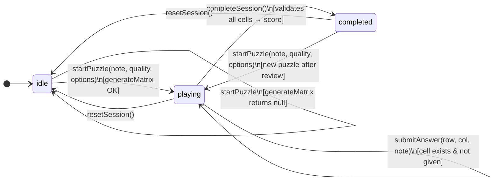
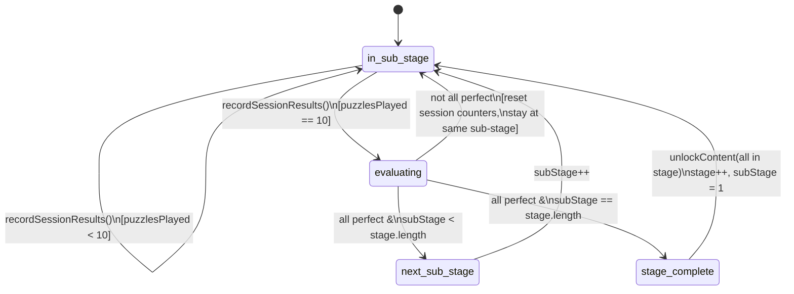

# UX State Analysis — Harmatrix Phase 1

Analysis extracted from the Phase 1 codebase as input for UX design.
Diagrams are authored in Mermaid and render natively on GitHub.

---

## Source files

| File | Role |
|------|------|
| `src/stores/game.ts` | GameSession state machine |
| `src/stores/progress.ts` | Learning progression & stats |
| `src/music/scoring.ts` | Answer validation & score calculation |
| `src/config/game.ts` | Curriculum definition & session constants |

---

## 1. GameSession state machine (`useGameStore`)

The `GameSession` type is a discriminated union with three phases.
Every UI view maps to exactly one of these phases.

### Payload per phase

| Phase | Available data |
|-------|----------------|
| `idle` | — |
| `playing` | `puzzle` (MatrixPuzzle), `answers[][]` (string\|null), `options` (ScoringOptions) |
| `completed` | `puzzle`, `results[][]` (AnswerResult[][]), `score` (number) |

### Key constraints

- `submitAnswer` silently no-ops on cells marked `isGiven` — the UI must prevent input on given cells.
- `completeSession` treats any `null` answer as `'wrong'` — the UI may want to warn before allowing submission with empty cells.
- `startPuzzle` can be called from `completed`, allowing a new game without going back through `idle`.

---

## 2. Learning progression (`useProgressStore`)

Not a classic state machine, but the `LearningPosition` + `SubStageSession` counters form
a deterministic progression graph. Persisted to `localStorage` under `harmatrix:progress`.

### Session size & curriculum

| Constant | Value | Meaning |
|----------|-------|---------|
| `SUB_STAGE_SESSION_SIZE` | 10 | Puzzles required per sub-stage evaluation window |

| Stage | Sub-stages (qualities) |
|-------|------------------------|
| 1 | `major`, `minor`, `aug`, `dim`, `sus2`, `sus4` — 6 sub-stages |
| 2 | `maj7`, `dom7`, `m7`, `mMaj7`, `m7b5`, `dim7`, `maj6`, `dom7sus4`, `dom9`, `dom7b9`, `dom7s9`, `dom7s11`, `dom13`, `alt` — 14 sub-stages |

### Progression rules

- A sub-stage requires **10 consecutive perfect puzzles** to advance (`all results === 'correct'`).
- Failing to go perfect resets only the session counters — `LearningPosition` does not change.
- Completing all sub-stages in a stage **unlocks all qualities** of that stage and advances to the next one.
- `updateStreak()` must be called explicitly by the UI after each session to maintain the daily streak.

### Stats tracked per quality

| Field | Meaning |
|-------|---------|
| `correct` | Cumulative cells answered with exact spelling |
| `enharmonic` | Cumulative cells answered with correct pitch but wrong spelling |
| `wrong` | Cumulative cells with wrong or missing answer |
| `total` | Sum of all cells across all sessions for this quality |

---

## 3. Scoring model

### Per-cell scoring

| Result | Points |
|--------|--------|
| `correct` | 3 |
| `enharmonic` | 1 |
| `wrong` | 0 |

### Session multiplier (difficulty modifiers)

| `noDegreeLabels` | `noPianoKeyboard` | Multiplier |
|:----------------:|:-----------------:|:----------:|
| false | false | ×1.0 |
| true | false | ×1.5 |
| false | true | ×1.5 |
| true | true | ×2.5 |

`final score = Σ(cell points) × multiplier`

The multiplier is not retroactive — it is locked at session start via `ScoringOptions`.

---

## 4. UI implications

These are constraints derived directly from the state machine, not design decisions:

- **Three distinct views are required** — one per `GameSession` phase (`idle`, `playing`, `completed`).
- **The matrix is the core interaction surface** — the `playing` phase is where the user spends the majority of time.
- **Difficulty must be configured before starting** — `ScoringOptions` is passed to `startPuzzle` and cannot change mid-session.
- **No partial saves** — there is no `paused` state; leaving mid-session loses all answers.
- **Progress is implicit** — `recordSessionResults` and `updateStreak` must be wired by the UI after `completeSession`, they are not automatic.
- **Content is gated** — the `playing` view needs to know which qualities are available (`unlockedContent`) to populate the puzzle selector.
